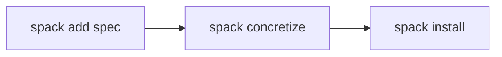

---
# You can also start simply with 'default'
theme: seriph
colorSchema: auto
# random image from a curated Unsplash collection by Anthony
# like them? see https://unsplash.com/collections/94734566/slidev
# background: https://cdn.jsdelivr.net/gh/slidevjs/slidev-covers@main/static/tZr3_JuURZA.webp
background: https://images.pexels.com/photos/11047223/pexels-photo-11047223.jpeg?cs=srgb&dl=pexels-vlad-samoylik-173187996-11047223.jpg&fm=jpg&w=1920&h=1282
# some information about your slides (markdown enabled)
title: Spack Tutorial for Beginners
info: |
  ## Slidev Starter Template
  Presentation slides for developers.

  Learn more at [Sli.dev](https://sli.dev)
# apply unocss classes to the current slide
class: text-center
# https://sli.dev/features/drawing
drawings:
  persist: false
# slide transition: https://sli.dev/guide/animations.html#slide-transitions
transition: slide-left
# enable MDC Syntax: https://sli.dev/features/mdc
mdc: false
# open graph
# seoMeta:
#  ogImage: https://cover.sli.dev
fonts:
  mono: iosevka-normal
  local: iosevka-normal
favicon: https://numpex-pc5.gitlabpages.inria.fr/tutorials/images/favicon.png

hideInToc: true
---

<div class="flex flex-row items-center justify-center gap-12">
  
  <div class="flex flex-col items-start">
    <h1 class="font-black text-left">Spack Tutorial for Beginners</h1>
    <h3>NumPEx WP3 / WP4</h3>
    <h4><u>Thomas Bouvier</u> with many slides from Fernando Ayats Llamas</h4>
  </div>
</div>


---
src: ./slides/intro.md
---

---
hideInToc: true
layout: center
---

# Hands-on tutorial

- SSH into a computer center -- we use Grid'5000 in this tutorial.
- Install Spack, discover some of its commands.
- Install and run a Kokkos application, and run with GPU support.
- Time for questions and discussion.


---

# The mental model

These are some of the key insights to understand how Spack works:

- 📦 Install Spack by cloning the [repo](https:://github.com/spack/spack). Multiple installations allowed.
- ✅ Activate Spack to run commands.
- 📌 Available package versions depend on your Spack clone.
- 🌍 Write a list of "package specs" to be installed in your Spack environment.
- 🤝 Integrate system packages with "externals".
- 🎛️ Package specs allow to pass options like <code class="color-blue">+cuda</code>.

---

# Running example: Kokkos + CUDA on Grid'5000


```
$ ssh lille.g5k
```

Connection guide: https://www.grid5000.fr/w/Getting_Started#Recommended_tips_and_tricks_for_an_efficient_use_of_Grid.275000

```ssh-config
# ~/.ssh/config
Host g5k
  User login
  Hostname access.grid5000.fr
  ForwardAgent no
Host *.g5k
  User login
  ProxyCommand ssh g5k -W "$(basename %h .g5k):%p"
  ForwardAgent no
```


---


To install Spack, make sure you have Python & Git; Then, we must clone the repo

```ansi
# ==> Clone Spack
$ git clone --depth=2 https://github.com/spack/spack.git
$ cd spack
$ git checkout 7e86478 # Locked Spack commit for the tutorial
$ cd ~

# ==> Activate Spack
$ . spack/share/spack/setup-env.sh
# For Fish Shell: source spack/share/spack/setup-env.fish

$ spack --version
1.2.0.dev0 (7e864787bd15a516314d86002ce1cbabde7cbbe9)
```

The Spack executable and the versions for all packages are located in the Spack folder `~/spack`.


---

# Finding a package

Web interface: https://packages.spack.io

```ansi
$ spack list kokkos
hpx-kokkos  kokkos  kokkos-kernels  kokkos-kernels-legacy  kokkos-legacy  kokkos-nvcc-wrapper  kokkos-tools  py-pennylane-lightning-kokkos  py-pykokkos-base
==> 9 packages

$ spack info kokkos
CMakePackage:   kokkos

Description:
    Kokkos implements a programming model in C++ for writing performance
    portable applications targeting all major HPC platforms.

Homepage: https://github.com/kokkos/kokkos
```


---


# Package specs

```ansi{1,2}
$ spack spec kokkos
 -   kokkos@4.5.01~aggressive_vectorization~alloc_async~cmake_lang~compiler_warnings+complex_align+cuda~cuda_constexpr~cuda_lambda~cuda_ldg_intrinsic~cuda_relocatable_device_code~cuda_uvm~debug~debug_bounds_check~debug_dualview_modify_check~deprecated_code~examples~hip_relocatable_device_code~hpx~hpx_async_dispatch~hwloc~ipo~memkind~numactl~openmp~openmptarget~pic~rocm+serial+shared~sycl~tests~threads~tuning~wrapper build_system=cmake build_type=Release cuda_arch=120 cxxstd=17 generator=make intel_gpu_arch=none arch=linux-ubuntu24.04-icelake
[+]      ^cmake@3.31.6~doc+ncurses+ownlibs~qtgui build_system=generic build_type=Release arch=linux-ubuntu24.04-icelake
[+]          ^curl@8.11.1~gssapi~ldap~libidn2~librtmp~libssh~libssh2+nghttp2 build_system=autotools libs=shared,static tls=openssl arch=linux-ubuntu24.04-icelake
[+]              ^nghttp2@1.65.0 build_system=autotools arch=linux-ubuntu24.04-icelake
[+]                  ^diffutils@3.10 build_system=autotools arch=linux-ubuntu24.04-icelake
[+]              ^openssl@3.4.1~docs+shared build_system=generic certs=mozilla arch=linux-ubuntu24.04-icelake
[+]                  ^ca-certificates-mozilla@2025-02-25 build_system=generic arch=linux-ubuntu24.04-icelake
...
```


Instead of package names, Spack uses **package specs**: a spec is like a name, but it has a version, compiler, architecture, and build options associated with it.

<code>
kokkos <span class="color-cyan">@4.5.01</span> <span class="color-blue">~aggressive_vectorization build_type=Release</span> ...
</code>

Going from a package name to such a concrete spec is called **concretizing**.

---

Spec documentation: https://spack.readthedocs.io/en/latest/package_fundamentals.html#specs-dependencies

<code>
kokkos <span class="color-cyan">@4.5.01</span> <span class="color-blue">~aggressive_vectorization build_type=Release</span> ...
</code>

- <code class="color-cyan">@4.5.01</code>: [Version specifier](https://spack.readthedocs.io/en/latest/basic_usage.html#version-specifier).
  - Spack concretizes packages to a fixed version <code class="color-cyan">@X.Y.Z</code>.
  - As a user, you can specify a version range, e.g:
    - <code class="color-cyan">@4.5:</code>: Take <code class="color-cyan">@4.5.0</code>, <code class="color-cyan">@4.5.1</code>, etc. / <code class="color-cyan">@:5</code>: Up to v5 included <code class="color-cyan">@5.0.0</code>, <code class="color-cyan">@5.1.0</code>, etc.
- <code class="color-blue">~aggressive_vectorization</code>: Variant specifier.
  - <code class="color-blue">+</code> means the feature is enabled / <code class="color-blue">~</code> means the feature is disabled.
  - Variants can also be <code class="color-blue">name=value</code> pairs.
- <code class="color-pink">target=x86_64</code>: Target specifier.
  - Similar to variants, but present in all packages.
  - Allows you to target some compiler microarhitecture, e.g. <code class="color-pink">target=haswell</code>

---

# Spack's Concretizer (= a Dependency Solver)

Given a set of requirements:

- System is a <code class="color-pink">debian11-x86_64</code>
- The compiler provided to us is `%gcc@10`
- Say we want:
  - Package <code>A<span class="color-cyan">@1.0:</span><span class="color-blue">+mpi</span></code>
  - Package <code>B<span class="color-blue">+cuda</span></code> which requires <code>A<span class="color-cyan">@1.2:</span><span class="color-blue">+cuda</span></code>

**... Concretization**

Result in what you see from `spack spec`, the actual dependency tree. <code>A<span class="color-cyan">@1.2:</span><span class="color-blue">+mpi+cuda</span></code> will be installed.

For a given set of specs, the concretizer solves all constraints (SAT problem) to generate a DAG of concrete dependencies.

---

```ansi{1,2,9}
$ spack spec kokkos +cuda cuda_arch=120
 -   kokkos@4.5.01~aggressive_vectorization~alloc_async~cmake_lang~compiler_warnings+complex_align+cuda~cuda_constexpr~cuda_lambda~cuda_ldg_intrinsic~cuda_relocatable_device_code~cuda_uvm~debug~debug_bounds_check~debug_dualview_modify_check~deprecated_code~examples~hip_relocatable_device_code~hpx~hpx_async_dispatch~hwloc~ipo~memkind~numactl~openmp~openmptarget~pic~rocm+serial+shared~sycl~tests~threads~tuning~wrapper build_system=cmake build_type=Release cuda_arch=120 cxxstd=17 generator=make intel_gpu_arch=none arch=linux-ubuntu24.04-icelake
[+]      ^cmake@3.31.6~doc+ncurses+ownlibs~qtgui build_system=generic build_type=Release arch=linux-ubuntu24.04-icelake
[+]          ^curl@8.11.1~gssapi~ldap~libidn2~librtmp~libssh~libssh2+nghttp2 build_system=autotools libs=shared,static tls=openssl arch=linux-ubuntu24.04-icelake
...
[+]          ^ncurses@6.5~symlinks+termlib abi=none build_system=autotools patches=7a351bc arch=linux-ubuntu24.04-icelake
[+]          ^zlib-ng@2.2.3+compat+new_strategies+opt+pic+shared build_system=autotools arch=linux-ubuntu24.04-icelake
[+]      ^compiler-wrapper@1.0 build_system=generic arch=linux-ubuntu24.04-icelake
 -       ^cuda@12.8.0~allow-unsupported-compilers~dev build_system=generic arch=linux-ubuntu24.04-icelake
[+]          ^libxml2@2.13.5~http+pic~python+shared build_system=autotools arch=linux-ubuntu24.04-icelake
[+]              ^libiconv@1.17 build_system=autotools libs=shared,static arch=linux-ubuntu24.04-icelake
[+]              ^xz@5.6.3~pic build_system=autotools libs=shared,static arch=linux-ubuntu24.04-icelake
[e]      ^gcc@13.3.0~binutils+bootstrap~graphite~mold~nvptx~piclibs~profiled~strip build_system=autotools build_type=RelWithDebInfo languages='c,c++,fortran' arch=linux-ubuntu24.04-icelake
...
```

Now we build the **CUDA-enabled Kokkos** tweaked for the `120` CUDA architecture.

---

Spack's concretizer also considers external dependencies from the system, while Guix (and Nix) is completely isolated down to `glibc`.

Spack does not fully achieve reproducibility, but it helps improve it.

<div class="flex justify-center">
  
</div>

With Spack, `gcc` is typically brought by an external system package.

---
disabled: true
---

Spack and Guix use a **Input addressing algorithm**. Each package is installed into a unique prefix. Multiple
packages with same name, but **different specs** may be "installed" at the same time.

We manage which packages are brought into scope with `spack load` or Spack environments.


```
$ ls -1 spack-tuto/opt/spack/linux-x86_64/

ca-certificates-mozilla-2025-02-25-czmj7w6shuex2krckv6zjb353xzg24g2
cmake-3.31.6-elkqc2tem57cee4zugaonlhrb2u3zhx6
compiler-wrapper-1.0-5rpljyjshkdolviqkg4q5ou4xdbvtxw2
curl-8.11.1-zw6anfi2jqysycmgwvwmkt5tupcfdaxe
gcc-runtime-10.2.1-ju5hltznpg4miborezunlvf67ahpqzhm
gmake-4.4.1-c5a2htejzzhhpsxcopn7y3zchmfs2hab
ncurses-6.5-dk4sla3ic3666dlgvpcj4x67tg3j7hch
nghttp2-1.65.0-mkpt6dhlz5tmlhioknbufphupwlj5ulm
```

---

# Bootstrapping Spack on Grid'5000 1/2

**Finding an external compiler**

The following command makes Spack aware of the <span v-mark.red="0">external system `gcc`</span>.

```
spack compiler find
```

The system `gcc` should have been configured in `~/.spack/bootstrap/config/packages.yaml`.


```
spack compiler list
```


---

# Bootstrapping Spack on Grid'5000 2/2

**Configuring some paths specific to Grid'5000**

The following commands will set <span v-mark.red="1">where packages will be installed / built</span>.

```
spack config --scope defaults:base add config:install_tree:root:/my-spack/spack
spack config --scope defaults:base add config:build_stage:/tmp/spack-stage
```

`spack config get` to get a reconstruction of the current Spack config; `spack config blame` to understand the provenance of each config attribute.


---

# Package installation

So, we're going to install Kokkos and some other packages, how do we do it?

```
$ spack install kokkos
...
```

<v-click>

...but let's use <span v-mark.red="1">environments</span> instead!


- 📦 Declarative -- run a single install command for everything.
- 👥 Shareable -- share the environment file `spack.yaml` with your colleagues.
- 🔒 Isolated -- environments won't conflict between each other.
- 📌 Versionable -- you can commit your `spack.yaml` alongside your project.

</v-click>

---

# Spack environments

From the [official documentation](https://spack.readthedocs.io/en/latest/environments.html):

<blockquote>

An environment is used to group a set of specs intended for some purpose to be built, rebuilt, and deployed in a coherent fashion. Environments define aspects of the installation of the software, such as:
  - which specs to install;
  - how those specs are configured; and
  - where the concretized software will be installed.

</blockquote>

<br/>

```ansi
$ spack env create --dir /tmp	/test
==> Created independent environment in: /tmp/test
==> Activate with: spack env activate /tmp/test

$ spack env activate ~/myenv
```

---
hideInToc: true
---

The generated environment file `spack.yaml` will look like the following:

```yaml
# ~/myenv/spack.yaml
spack:
  specs: []
  view: true
  concretizer:
    unify: true
```

- <span v-mark.red="-1"><code>specs</code>: List of packages to install.</span>

Less importantly:
- `view`: Use a filesystem view of the `install_tree` directory.
- `concretizer:unify`: Any package in the environment corresponds to a single concrete spec.

---

To add packages to the (currently activated) environment, we have 2 options:

- Manually edit the `spack.yaml` file using `spack config edit` (or vim).
- Call `spack add <spec>`, which will edit environment for us.

```ansi
$ spack add kokkos
==> Adding kokkos to environment /home/ubuntu/myenv
```

<br/>

```yaml
spack:
  specs:
  - kokkos
  view: true
  concretizer:
    unify: true
```

---

# Environment concretization

<br/>

<div class="w-full flex flex-row justify-center">



</div>

Concretization reads specs from `spack.yaml` to calculate the DAG of concrete dependencies.

This will generate a `spack.lock` locking every version of every package in place.

```ansi
$ spack concretize

# To force concretization and overwrite the spack.lock file
$ spack concretize --force
```

You may commit the `spack.lock` alongside `spack.yaml` to improve reproducibility.

---

```ansi {1,2}
fayatsllamas@chifflot-2 $ spack spec
 -   cmake@3.31.6~doc+ncurses+ownlibs~qtgui build_system=generic build_type=Release arch=linux-debian11-skylake_avx512
 -       ^compiler-wrapper@1.0 build_system=generic arch=linux-debian11-skylake_avx512
 -       ^curl@8.11.1~gssapi~ldap~libidn2~librtmp~libssh~libssh2+nghttp2 build_system=autotools libs:=shared,static tls:=openssl arch=linux-debian11-skylake_avx512
 -           ^nghttp2@1.65.0 build_system=autotools arch=linux-debian11-skylake_avx512
 -               ^diffutils@3.10 build_system=autotools arch=linux-debian11-skylake_avx512
 -                   ^libiconv@1.17 build_system=autotools libs:=shared,static arch=linux-debian11-skylake_avx512
 -           ^openssl@3.4.1~docs+shared build_system=generic certs=mozilla arch=linux-debian11-skylake_avx512
 -               ^ca-certificates-mozilla@2025-02-25 build_system=generic arch=linux-debian11-skylake_avx512
 -               ^perl@5.40.0+cpanm+opcode+open+shared+threads build_system=generic arch=linux-debian11-skylake_avx512
 -                   ^berkeley-db@18.1.40+cxx~docs+stl build_system=autotools patches:=26090f4,b231fcc arch=linux-debian11-skylake_avx512
 -                   ^bzip2@1.0.8~debug~pic+shared build_system=generic arch=linux-debian11-skylake_avx512
 -                   ^gdbm@1.23 build_system=autotools arch=linux-debian11-skylake_avx512
 -                       ^readline@8.2 build_system=autotools patches:=1ea4349,24f587b,3d9885e,5911a5b,622ba38,6c8adf8,758e2ec,79572ee,a177edc,bbf97f1,c7b45ff,e0013d9,e065038 arch=linux-debian11-skylake_avx512
 -           ^pkgconf@2.3.0 build_system=autotools arch=linux-debian11-skylake_avx512
[e]      ^gcc@10.2.1~binutils+bootstrap~graphite~nvptx~piclibs~profiled~strip build_system=autotools build_type=RelWithDebInfo languages:='c,c++,fortran' patches:=0d13622,2c18531,b5e049d,bd4828c,cc6112d arch=linux-debian11-skylake_avx512
 -       ^gcc-runtime@10.2.1 build_system=generic arch=linux-debian11-skylake_avx512
[e]      ^glibc@2.31 build_system=autotools arch=linux-debian11-skylake_avx512
 -       ^gmake@4.4.1~guile build_system=generic arch=linux-debian11-skylake_avx512
 -       ^ncurses@6.5~symlinks+termlib abi=none build_system=autotools patches:=7a351bc arch=linux-debian11-skylake_avx512
 -       ^zlib-ng@2.2.4+compat+new_strategies+opt+pic+shared build_system=autotools arch=linux-debian11-skylake_avx512
 -   kokkos@4.6.00~aggressive_vectorization~cmake_lang~compiler_warnings+complex_align~cuda~debug~debug_bounds_check~debug_dualview_modify_check~deprecated_code~examples~hip_relocatable_device_code~hpx~hpx_async_dispatch~hwloc~ipo~memkind~numactl~openmp~openmptarget~pic~rocm+serial+shared~sycl~tests~threads~tuning~wrapper build_system=cmake build_type=Release cxxstd=17 generator=make intel_gpu_arch=none arch=linux-debian11-skylake_avx512
```

<br/>

- <code class="text-pink">arch=linux-debian11-skylake_avx512</code> When concretized on the machine `chifflot-2`.
- <code class="text-pink">arch=linux-ubuntu24.04-icelake</code> When concretized on my laptop.

<style>
pre {
  max-height: 300px;
}
</style>

---

# Locking the concretizer arch

Locking the environment to the least common denominator of the machines to use:

```yaml
spack:
  specs:
  - kokkos
  - cmake
  view: true
  concretizer:
    unify: true
  packages: # [!code ++]
    all: # [!code ++]
      require: target=x86_64 # [!code ++]
```


```
$ spack concretize --force
```


---

If you skip the concretization step `spack concretize`, `spack install` will concretize for each run (which takes time), and won't save it to the `spack.lock`.


```json
// spack.lock
{
  "_meta": {
    "file-type": "spack-lockfile",
    "lockfile-version": 6,
    "specfile-version": 5
  },
  "spack": {
    "version": "1.0.0.dev0",
    "type": "git",
    "commit": "199133fca402022a27002a54f25d735e7a27cce5"
  },
  "roots": [
    {
      "hash": "ylsnhrukizj6kfprn5rbawyaophnkwgw",
      "spec": "kokkos"
    }
  ],
  "concrete_specs": {
    "ylsnhrukizj6kfprn5rbawyaophnkwgw": {
      "name": "kokkos",
// ...
```

<style>
pre {
  font-size: 0.5rem !important;
  line-height: 0.5rem !important;
}
</style>


---

# Using a binary cache (= buildcache / mirror)

Compilation can take quite some time depending on your hardware: adding a binary cache may dramatically speeds up the process.

```yaml
spack:
  specs:
  - kokkos
  - cmake
  ...
  mirrors: # [!code ++]
    numpex-spack-mirror:  # [!code ++]
      url: oci://ghcr.io/thomas-bouvier/numpex-spack-mirror  # [!code ++]
```

Adding such a binary cache will influence the concretizer, which will try to reuse available binaries compatible with your specs.

[Official documentation](https://spack.readthedocs.io/en/latest/binary_caches.html) on buildcaches.


---

# Preparing a development environment


```
$ git clone https://github.com/thomas-bouvier/kokkos-hello-world ~/kokkos-hello-world
$ cd ~/kokkos-hello-world

$ spack env activate .
$ spack spec
```

---

# Building our project

```
$ spack install --use-build-cache only
...
$ cmake -B build
$ cmake --build build
```

<br/>

```cmake
cmake_minimum_required(VERSION 3.16)
project(MyProject LANGUAGES CXX)

find_package(Kokkos REQUIRED)
add_executable(myapp main.cpp)
target_link_libraries(myapp PRIVATE Kokkos::kokkos)
```

---

# Running our App

For development, if we used `kokkos ~cuda`, we can run it directly. For the GPU version, go into a GPU node:

```ansi
# Interactive shell on a CPU partition
$ oarsub --project lab-2025-numpex-exadi-spack -t allowed=special \
  -I -p chiclet -l /host=1,walltime=0:05:00

# Interactive shell on a GPU node
$ oarsub --project lab-2025-numpex-exadi-spack -t allowed=special \
  -I -p chifflot -l /host=1,walltime=0:05:00

# Interactive shell on a GPU node with only 1 GPU
$ oarsub --project lab-2025-numpex-exadi-spack -t allowed=special
  -I -p chifflot -l /host=1,walltime=0:05:00
```

```
$ ./build/myapp
```

---

# Recommended workflow

For local development:
- Start with a `spack.yaml`
- Add you project dependencies.

For advanced users:
- Use Spack's official cache or setup a cache on CI/CD.
- Package your application itself.


---
src: ./slides/compiler.md
---

---
src: ./slides/externals.md
---


---
layout: center
---

# Advanced topics


---

# Writing a package recipe

- [Official documentation](https://spack-tutorial.readthedocs.io/en/latest/tutorial_packaging.html) on package recipes.
- `spack create -n my-package`: Generate a new package recipe.

```python
class MyPackage(CMakePackage):
  git = "file:///path/to/repo"  # or https://...

  version("main", branch="main")

  depends_on("mpi")
  depends_on("blas")
  depends_on("cuda")
```

```yaml
spack:
  specs:
  - my-package ^cuda@11 ^mpich@4 +fortran ^openblas
```

---

# Developing a package 1/2

The `spack develop` command

```
$ spack develop --path /path/to/my/sources my-package@main
$ spack concretize --force
```

just updates the `spack.yaml` file:

```yaml
spack:
  specs:
  - my-package ^cuda@11 ^mpich@4 +fortran ^openblas
  develop:
    my-package:
      spec: my-package@=main
      path: /path/to/my/sources
```

---

# Developing a package 2/2

After concretization, you will see a "reserved" variant <span class="color-blue">dev_path=</span>.

<code>
my-package <span class="color-cyan">@main</span> <span class="color-blue">%gcc@13.2.0 dev_path=/path/to/my/sources</span>
</code>

and `spack install` will automatically do an overwrite install if any of the source files change (similarly to `make install`).

```
$ touch /path/to/my/sources/my-package.c
$ spack install  # 🔁
```


---
src: ./slides/sources.md
---
