---
# You can also start simply with 'default'
theme: seriph
colorSchema: auto
# random image from a curated Unsplash collection by Anthony
# like them? see https://unsplash.com/collections/94734566/slidev
# background: https://cdn.jsdelivr.net/gh/slidevjs/slidev-covers@main/static/tZr3_JuURZA.webp
background: https://images.pexels.com/photos/11047223/pexels-photo-11047223.jpeg?cs=srgb&dl=pexels-vlad-samoylik-173187996-11047223.jpg&fm=jpg&w=1920&h=1282
# some information about your slides (markdown enabled)
title: Spack Tutorial for Beginners
info: |
  ## Slidev Starter Template
  Presentation slides for developers.

  Learn more at [Sli.dev](https://sli.dev)
# apply unocss classes to the current slide
class: text-center
# https://sli.dev/features/drawing
drawings:
  persist: false
# slide transition: https://sli.dev/guide/animations.html#slide-transitions
transition: slide-left
# enable MDC Syntax: https://sli.dev/features/mdc
mdc: false
# open graph
# seoMeta:
#  ogImage: https://cover.sli.dev
fonts:
  mono: iosevka-normal
  local: iosevka-normal
favicon: https://numpex-pc5.gitlabpages.inria.fr/tutorials/images/favicon.png

hideInToc: true
---

<div class="flex flex-row items-center justify-center gap-12">
  
  <div class="flex flex-col items-start">
    <h1 class="font-black text-left">Spack Tutorial for Beginners</h1>
    <h3><a href="https://numpex.org/">NumPEx</a> <a href="https://numpex.org/exadi-development-and-integration/">Exa-DI WP3</a></h3>
    <h4><u>Thomas Bouvier</u> with a few slides from Fernando Ayats Llamas</h4>
  </div>
</div>


---
src: ./slides/intro.md
---

---
hideInToc: true
layout: center
---

# Hands-on tutorial

- SSH into a computer center -- we use Grid'5000 in this tutorial.
- Install Spack, discover some of its commands.
- Install the Kokkos library.
- Install and run a Gysela mini-app relying on Kokkos, and run it (optionally with GPU support).
- Time for questions and discussion.


---

## The mental model

These are some of the key insights to understand how Spack works:

- 📦 Install Spack by cloning the [repo](https:://github.com/spack/spack). Multiple installations allowed.
- ✅ Activate Spack to run commands.
- 📌 Available package versions depend on your Spack clone.
- 🤝 Integrate system packages with "externals".
- 🌍 Write a list of "package specs" to be installed in your Spack environment.
- 🎛️ Package specs allow to pass options like <code class="color-blue">+cuda</code>.

---

## Running example: Kokkos → a Gysela app on Grid'5000


```
$ ssh lille.g5k
```

Connection guide: https://www.grid5000.fr/w/Getting_Started#Recommended_tips_and_tricks_for_an_efficient_use_of_Grid.275000

```ssh-config
# ~/.ssh/config
Host g5k
  User login
  Hostname access.grid5000.fr
  ForwardAgent no
Host *.g5k
  User login
  ProxyCommand ssh g5k -W "$(basename %h .g5k):%p"
  ForwardAgent no
```


---


To install Spack, make sure you have Python & Git. Then, we must clone the repo on the Grid'5000 frontend:

```ansi
# ==> Clone Spack
$ git clone --depth=100 https://github.com/spack/spack.git ~/spack
$ cd spack
$ git checkout af1edd4 # Locked Spack commit for the tutorial
$ cd ~

# ==> Activate Spack
$ . spack/share/spack/setup-env.sh
# For Fish Shell: source spack/share/spack/setup-env.fish

$ spack --version
1.2.0.dev0 (af1edd44f13ed3fb53c7f647c7e25280f8bc817e)
```

The Spack executable and the versions for all packages are located in the Spack folder `~/spack`.


---

## Finding a package

Web interface: https://packages.spack.io

```ansi
$ spack list kokkos
hpx-kokkos  kokkos  kokkos-fft  kokkos-kernels  kokkos-nvcc-wrapper  kokkos-tools  py-pennylane-lightning-kokkos  py-pykokkos-base
==> 8 packages

$ spack info kokkos
CMakePackage:   kokkos

Description:
    Kokkos implements a programming model in C++ for writing performance
    portable applications targeting all major HPC platforms.

Homepage: https://github.com/kokkos/kokkos
```

You can also use `spack list 'py-*'`.

---


## Package specs

```ansi{1,2}
$ spack spec kokkos
 -   kokkos@4.7.03~aggressive_vectorization~atomics_bypass~cmake_lang~compiler_warnings+complex_align~cuda~debug~debug_bounds_check+debug_dualview_modify_check~deprecated_code~hip_relocatable_device_code~hpx~hpx_async_dispatch~hwloc~ipo~memkind~numactl~openmp~openmptarget~pic~rocm+serial+shared~sycl~tests~threads~tuning~wrapper build_system=cmake build_type=Release cxxstd=17 generator=make intel_gpu_arch=none platform=linux os=debian11 target=x86_64 %cxx=gcc@10.2.1
 -       ^cmake@3.31.11~doc+ncurses+ownlibs~qtgui build_system=generic build_type=Release platform=linux os=debian11 target=x86_64 %c,cxx=gcc@10.2.1
 -           ^curl@8.18.0~gssapi~ldap~libidn2~librtmp~libssh~libssh2+nghttp2 build_system=autotools libs:=shared,static tls:=openssl platform=linux os=debian11 target=x86_64 %c,cxx=gcc@10.2.1
 -               ^nghttp2@1.67.1 build_system=autotools platform=linux os=debian11 target=x86_64 %c,cxx=gcc@10.2.1
 -                   ^diffutils@3.12 build_system=autotools platform=linux os=debian11 target=x86_64 %c=gcc@10.2.1
 -                       ^libiconv@1.18 build_system=autotools libs:=shared,static platform=linux os=debian11 target=x86_64 %c=gcc@10.2.1
 -               ^openssl@3.6.1~docs+shared build_system=generic certs=mozilla platform=linux os=debian11 target=x86_64 %c,cxx=gcc@10.2.1
 -                   ^ca-certificates-mozilla@2026-03-19 build_system=generic platform=linux os=debian11 target=x86_64 
...
```

Instead of package names, Spack uses **package specs**: a concrete spec is like a name, but it has a version, compiler, architecture, and build options associated with it.

<code>
kokkos <span class="color-cyan">@4.7.03</span> <span class="color-blue">~aggressive_vectorization ~atomics_bypass</span> ...
</code>

Going from a package name to such a concrete spec is called **concretizing**.

---

Spec documentation: https://spack.readthedocs.io/en/latest/package_fundamentals.html#specs-dependencies

<code>
kokkos <span class="color-cyan">@4.7.03</span> <span class="color-blue">~aggressive_vectorization</span> <span class="color-pink">target=x86_64 %c,cxx=gcc@10.2.1</span>
</code>

- <code class="color-cyan">@4.7.03</code>: [Version specifier](https://spack.readthedocs.io/en/latest/basic_usage.html#version-specifier).
  - Spack concretizes packages to a fixed version <code class="color-cyan">@X.Y.Z</code>.
  - As a user, you can specify a version range, e.g:
    - <code class="color-cyan">@4.7:</code>: Take <code class="color-cyan">@4.7.00</code>, <code class="color-cyan">@4.7.01</code>, etc. / <code class="color-cyan">@:5</code>: Up to v5 included <code class="color-cyan">@5.0.0</code>, <code class="color-cyan">@5.1.0</code>, etc.
- <code class="color-blue">~aggressive_vectorization</code>: Variant specifier.
  - <code class="color-blue">+</code> means the feature is enabled / <code class="color-blue">~</code> means the feature is disabled.
  - Variants can also be <code class="color-blue">name=value</code> pairs.
- <code class="color-pink">target=x86_64</code>: Target specifier.
  - Similar to variants, but present in all packages.
- <code class="color-pink">%c,cxx=gcc@10.2.1</code>: Dependencies on compilers are also modeled by specs.

---

## Spack's Concretizer (= a Dependency Solver)

Given a set of requirements, in this case <span v-mark.red="0">two root specs</span>:

- Package <code>A<span class="color-cyan">@1.0:</span><span class="color-blue">+mpi</span></code>
- Package <code>B<span class="color-blue">+cuda</span></code> which requires <code>A<span class="color-cyan">@1.2:</span><span class="color-blue">+cuda</span></code>

**... Concretization**

Result is what you see from `spack spec`, the actual dependency tree of concrete specs.

<code>A<span class="color-cyan">@1.2:</span><span class="color-blue">+mpi+cuda</span></code> will be installed.

For a given set of specs, the concretizer solves all constraints (SAT problem) to generate a DAG of concrete dependencies.


---

## Concretizing `kokkos@5`

```
$ spack spec kokkos@5     
==> Error: failed to concretize `kokkos@5` for the following reasons:
     1. kokkos: '%gcc@:10.3' conflicts with '@5:'
     2. kokkos: '%gcc@:10.3' conflicts with '@5:'
        required because conflict is triggered when %gcc@:10.3 
          required because gcc-runtime depends on gcc 
          required because kokkos@5 requested explicitly
```

The concretizer cannot solve the set of constraints needed by `kokkos@5`: a recent `gcc` is needed.

```
$ spack compiler list 
==> Available compilers
-- gcc debian11-x86_64 ------------------------------------------
[e]  gcc@10.2.1
```


---

Spack's concretizer also considers external dependencies from the system, while Guix (and Nix) is completely isolated down to `glibc`.

Spack does not fully achieve reproducibility, but it helps improve it.

<div class="flex justify-center">
  
</div>

With Spack, `gcc` is typically brought by an external system package.


---

## Loading the compiler from the compute center


Let's inspect modules made available to us on Grid'5000:

```
$ module av                
---------------------------------------------------------------------------------------------- /grid5000/spack/v1/share/spack/modules/linux-debian11-x86_64_v2 ----------------------------------------------------------------------------------------------
   gcc/10.4.0_gcc-10.4.0             intel-oneapi-vtune/2022.3.0_gcc-10.4.0               pmix/4.1.2_gcc-10.4.0                                         tau/2.32_gcc-10.4.0-openmpi
   gcc/12.2.0_gcc-10.4.0             intel-oneapi-vtune/2023.0.0_gcc-10.4.0        (D)    py-numpy/1.23.3_gcc-10.4.0-intelmpi-python-3.9.13             ucx/1.13.1_gcc-10.4.0-compat
   gcc/13.2.0_gcc-10.4.0      (D)    julia/1.8.2_gcc-10.4.0                               py-numpy/1.24.2_gcc-10.4.0-python-3.9.13               (D)    ucx/1.13.1_gcc-10.4.0                   (D)
```

```
$ module load gcc/13
```


The following command makes Spack aware of the <span v-mark.red="0">external system `gcc`</span>.

```
$ spack compiler find
$ spack compiler list
```

The system `gcc` should have been configured in `~/.spack/packages.yaml`.


---

```ansi{1,2}
$ spack spec kokkos@5
 -   kokkos@5.1.0~aggressive_vectorization~atomics_bypass~cmake_lang+complex_align~cuda~debug~debug_bounds_check+deprecated_code~hip_relocatable_device_code~hpx~hwloc~ipo~openmp~openmptarget~pic~rocm+serial+shared~sycl~tests~threads~tuning~wrapper build_system=cmake build_type=Release cxxstd=20 generator=make intel_gpu_arch=none platform=linux os=debian11 target=x86_64 %cxx=gcc@13.2.0
 -       ^cmake@3.31.11~doc+ncurses+ownlibs~qtgui build_system=generic build_type=Release platform=linux os=debian11 target=x86_64 %c,cxx=gcc@13.2.0
 -           ^curl@8.18.0~gssapi~ldap~libidn2~librtmp~libssh~libssh2+nghttp2 build_system=autotools libs:=shared,static tls:=openssl platform=linux os=debian11 target=x86_64 %c,cxx=gcc@13.2.0
 -               ^nghttp2@1.67.1 build_system=autotools platform=linux os=debian11 target=x86_64 %c,cxx=gcc@13.2.0
 -                   ^diffutils@3.12 build_system=autotools platform=linux os=debian11 target=x86_64 %c=gcc@13.2.0
 -                       ^libiconv@1.18 build_system=autotools libs:=shared,static platform=linux os=debian11 target=x86_64 %c=gcc@13.2.0
 -               ^openssl@3.6.1~docs+shared build_system=generic certs=mozilla platform=linux os=debian11 target=x86_64 %c,cxx=gcc@13.2.0
 -                   ^ca-certificates-mozilla@2026-03-19 build_system=generic platform=linux os=debian11 target=x86_64 
 -                   ^perl@5.42.0+cpanm+opcode+open+shared+threads build_system=generic platform=linux os=debian11 target=x86_64 %c=gcc@13.2.0
 -                       ^berkeley-db@18.1.40+cxx~docs+stl build_system=autotools patches:=26090f4,b231fcc platform=linux os=debian11 target=x86_64 %c,cxx=gcc@13.2.0
 -                       ^bzip2@1.0.8~debug~pic+shared build_system=generic platform=linux os=debian11 target=x86_64 %c=gcc@13.2.0
 ...
```

The concretization is now successfull for `kokkos@5`.

Notice the <code class="color-pink">`target=x86_64 %c=gcc@13.2.0`</code> in the concretized specs.


---

## Bootstrapping Spack on Grid'5000


`spack config get` is useful to get a reconstruction of the current Spack config.

`spack config blame` is useful to understand the provenance of each config attribute.

The following command will set <span v-mark.red="1">where packages will be built. Important on Grid'5000.</span>

```
$ spack config --scope defaults:base add config:build_stage:/tmp/spack-stage
```

You can also edit the config file manually as follows:

```
$ spack config --scope defaults:base edit config
```


<v-click>

You may set the `install_tree` to [Group Storage](https://www.grid5000.fr/w/Group_Storage) over NFS:

```
$ ln - s /srv/storage/my-group-storage@storage1.lyon.grid5000.fr/ /my-spack
$ spack config --scope defaults:base add config:install_tree:root:/my-spack/spack
```

</v-click>


---

## Package installation

So, we're going to install Kokkos and some other packages, how do we do it?

```
$ spack install kokkos
...
```

```
Progress: 19/21  +/-: 4 jobs  /: filter  v: logs  n/p: next/prev
```

Once installed, you can make the package available with:

```
$ spack load kokkos
```

<v-click>

...but let's use <span v-mark.red="1">environments</span> instead!


- 📦 Multiple root specs -- run a single install command for all the packages you need.
- 👥 Shareable / versionable -- share the environment file `spack.yaml` with your colleagues.
- 🔒 Isolated -- environments won't conflict between each other.

</v-click>

---

## Spack environments

From the [official documentation](https://spack.readthedocs.io/en/latest/environments.html):

<blockquote>

An environment is used to group a set of specs intended for some purpose to be built, rebuilt, and deployed in a coherent fashion. Environments define aspects of the installation of the software, such as:
  - which specs to install;
  - how those specs are configured; and
  - where the concretized software will be installed.

</blockquote>

<br/>

```ansi
$ spack env create gysela-io
==> Created environment gysela-io in: /home/tbouvier/spack/var/spack/environments/gysela-io
==> Activate with: spack env activate gysela-io

$ spack env activate gysela-io
```

`spack env status` is usefull to check which environment in currently activated.


---
hideInToc: true
---

`spack config edit` allows to open the environment file `spack.yaml`.

```yaml
# ~/spack/var/spack/environments/gysela-io/spack.yaml
spack:
  specs:  # These are root specs
  - A
  - B
  view: true
  concretizer:
    unify: true
```

- <span v-mark.red="-1"><code>specs</code>: List of packages to install.</span>

Less importantly:
- `view`: Use a filesystem view of the `install_tree` directory.
- `concretizer:unify`: All packages are reused across root specs' dependencies.

---

To add packages to the (currently activated) environment, we have 2 options:

- Manually edit the `spack.yaml` file using `spack config edit` (or vim).
- Call `spack add <spec>`, which will edit environment for us.

```ansi
$ spack add kokkos
==> Adding kokkos to environment gysela-io
```

<br/>

```yaml
spack:
  specs:
  - kokkos
  view: true
  concretizer:
    unify: true
```

---

We could build a CUDA-enabled kokkos instead:

```ansi{1,2,7}
$ spack add kokkos +wrapper +cuda cuda_arch=60
 -   kokkos@5.1.0~aggressive_vectorization~alloc_async~cmake_lang+complex_align+cuda~cuda_constexpr~cuda_relocatable_device_code~debug~debug_bounds_check+deprecated_code~hip_relocatable_device_code~hpx~hwloc~ipo~openmp~openmptarget~pic~rocm+serial+shared~sycl~tests~threads~tuning~wrapper build_system=cmake build_type=Release cuda_arch=60 cxxstd=20 generator=make intel_gpu_arch=none platform=linux os=debian11 target=x86_64 %cxx=gcc@13.2.0
 -       ^cmake@3.30.9~doc+ncurses+ownlibs~qtgui build_system=generic build_type=Release patches:=dbc3892,fdea723 platform=linux os=debian11 target=x86_64 %c,cxx=gcc@10.2.1
 -           ^compiler-wrapper@1.0 build_system=generic platform=linux os=debian11 target=x86_64 
[e]          ^gcc@10.2.1~binutils+bootstrap~graphite~nvptx~piclibs~profiled~strip build_system=autotools build_type=RelWithDebInfo languages:='c,c++,fortran' platform=linux os=debian11 target=x86_64 
...
 -       ^cuda@12.9.1~allow-unsupported-compilers~dev build_system=generic platform=linux os=debian11 target=x86_64 
 -           ^coreutils@9.10~gprefix build_system=autotools platform=linux os=debian11 target=x86_64 %c=gcc@13.2.0
 -           ^gzip@1.14 build_system=autotools platform=linux os=debian11 target=x86_64 %c=gcc@13.2.0
 -           ^libxml2@2.13.5~http+pic~python+shared build_system=autotools platform=linux os=debian11 target=x86_64 %c=gcc@10.2.1
 -               ^libiconv@1.18 build_system=autotools libs:=shared,static platform=linux os=debian11 target=x86_64 %c=gcc@10.2.1
 -               ^xz@5.6.3~pic build_system=autotools libs:=shared,static platform=linux os=debian11 target=x86_64 %c=gcc@10.2.1
...
```

Nodes `chifflot-[1-6]` are equipped with 2 x Tesla P100 GPUs (compute capability 6.0).


---

## Get a complete environment for my Gysela app

Say I am developing a C++ app in the Gysela system:

- Demonstrating I/O operations.
- Testing the CPU performance scaling for 5D particle distribution functions.

```
$ cd ~
$ git clone --recursive https://github.com/thomas-bouvier/gysela-mini-app_io
```

**... the package for my app is not in Spack yet**

- Actually, `py-gysela` is not even available in Spack (https://packages.spack.io/)
- We have to declare all dependencies appearing in our app in a `spack.yaml` file.

<v-click>

The work of writing the `spack.yaml` file has been done in the repository you just cloned.

```
$ rm ~/spack/var/spack/environments/gysela-io/spack.yaml
$ cp ~/gysela-mini-app_io/spack.yaml ~/spack/var/spack/environments/gysela-io/
```

</v-click>


---

## Environment concretization

<br/>

<div class="w-full flex flex-row justify-center">


</div>

Concretization reads specs from `spack.yaml` to calculate the DAG of concrete dependencies.

This will generate a `spack.lock` locking every version of every package in place.

```ansi
$ spack concretize

# To force concretization and overwrite the spack.lock file
$ spack concretize --force
```

You may commit the `spack.lock` alongside `spack.yaml` to improve reproducibility.


---

If you skip the concretization step `spack concretize`, `spack install` will concretize for each run (which takes time), and won't save it to the `spack.lock`.


```json
// spack.lock
{
  "_meta": {
    "file-type": "spack-lockfile",
    "lockfile-version": 6
  },
  "roots": [
    {
      "hash": "ylsnhrukizj6kfprn5rbawyaophnkwgw",
      "spec": "kokkos"
// ...
```

---

## Where to install our packages?

We are ready to run `spack install`. Where to do it?

It depends on the computing center. <span v-mark.red="1">By default, you should compile on a compute node</span> (only 8 GB of RAM on Grid'5000 frontends).

```ansi
# Interactive shell on a CPU partition
$ oarsub --project lab-2026-numpex-spack-tutorial -t allowed=special \
  -I -p chiclet -l host=1/core=4,walltime=2:00:00

# Use chifflot for a GPU node with host=1/gpu=1
```

<v-click>

We must remember to load Spack here:

```
$ . spack/share/spack/setup-env.sh
$ module load gcc/13
$ spack env activate gysela-io && spack install
```

</v-click>


---

## Compilation errors

If you get a compilation error for a specific Spack package, [please open an issue](https://github.com/spack/spack-packages/issues) about it.

The maintainer of the [package recipe](https://github.com/spack/spack-packages/blob/develop/repos/spack_repo/builtin/packages/kokkos/package.py) will be notified about your issue.

<image class="flex flex-col items-center">
  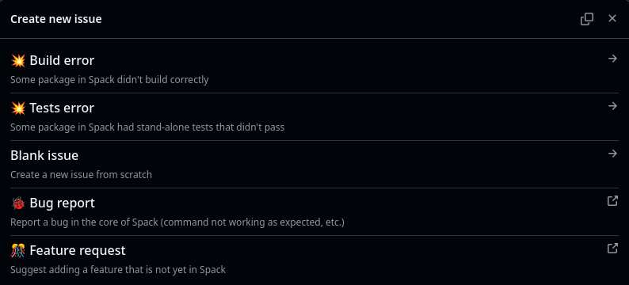
  <strong>Posting a GitHub issue</strong>
</image>

Once merged, the fix can be retrieved using `spack repo update`.


---

## Using a binary cache (= buildcache / mirror)

Compilation can take quite some time depending on your hardware: adding a binary cache may dramatically speeds up the process.

```yaml
spack:
  specs:
  - ...
  mirrors: # [!code ++]
    numpex-spack-mirror:  # [!code ++]
      url: oci://ghcr.io/thomas-bouvier/numpex-spack-mirror  # [!code ++]
```

Adding such a binary cache will influence the concretizer, which will try to reuse available binaries compatible with your specs.

[Official documentation](https://spack.readthedocs.io/en/latest/binary_caches.html) on buildcaches.


---

```ansi {1,2}
tbouvier@chifflot-2 $ spack spec
 -   cmake@3.31.6~doc+ncurses+ownlibs~qtgui build_system=generic build_type=Release arch=linux-debian11-skylake_avx512
 -       ^compiler-wrapper@1.0 build_system=generic arch=linux-debian11-skylake_avx512
 -       ^curl@8.11.1~gssapi~ldap~libidn2~librtmp~libssh~libssh2+nghttp2 build_system=autotools libs:=shared,static tls:=openssl arch=linux-debian11-skylake_avx512
 -           ^nghttp2@1.65.0 build_system=autotools arch=linux-debian11-skylake_avx512
 -               ^diffutils@3.10 build_system=autotools arch=linux-debian11-skylake_avx512
 -                   ^libiconv@1.17 build_system=autotools libs:=shared,static arch=linux-debian11-skylake_avx512
 -           ^openssl@3.4.1~docs+shared build_system=generic certs=mozilla arch=linux-debian11-skylake_avx512
 -               ^ca-certificates-mozilla@2025-02-25 build_system=generic arch=linux-debian11-skylake_avx512
 -               ^perl@5.40.0+cpanm+opcode+open+shared+threads build_system=generic arch=linux-debian11-skylake_avx512
 -                   ^berkeley-db@18.1.40+cxx~docs+stl build_system=autotools patches:=26090f4,b231fcc arch=linux-debian11-skylake_avx512
 -                   ^bzip2@1.0.8~debug~pic+shared build_system=generic arch=linux-debian11-skylake_avx512
 -                   ^gdbm@1.23 build_system=autotools arch=linux-debian11-skylake_avx512
 -                       ^readline@8.2 build_system=autotools patches:=1ea4349,24f587b,3d9885e,5911a5b,622ba38,6c8adf8,758e2ec,79572ee,a177edc,bbf97f1,c7b45ff,e0013d9,e065038 arch=linux-debian11-skylake_avx512
 -           ^pkgconf@2.3.0 build_system=autotools arch=linux-debian11-skylake_avx512
[e]      ^gcc@10.2.1~binutils+bootstrap~graphite~nvptx~piclibs~profiled~strip build_system=autotools build_type=RelWithDebInfo languages:='c,c++,fortran' patches:=0d13622,2c18531,b5e049d,bd4828c,cc6112d arch=linux-debian11-skylake_avx512
 -       ^gcc-runtime@10.2.1 build_system=generic arch=linux-debian11-skylake_avx512
[e]      ^glibc@2.31 build_system=autotools arch=linux-debian11-skylake_avx512
 -       ^gmake@4.4.1~guile build_system=generic arch=linux-debian11-skylake_avx512
 -       ^ncurses@6.5~symlinks+termlib abi=none build_system=autotools patches:=7a351bc arch=linux-debian11-skylake_avx512
 -       ^zlib-ng@2.2.4+compat+new_strategies+opt+pic+shared build_system=autotools arch=linux-debian11-skylake_avx512
 -   kokkos@4.6.00~aggressive_vectorization~cmake_lang~compiler_warnings+complex_align~cuda~debug~debug_bounds_check~debug_dualview_modify_check~deprecated_code~examples~hip_relocatable_device_code~hpx~hpx_async_dispatch~hwloc~ipo~memkind~numactl~openmp~openmptarget~pic~rocm+serial+shared~sycl~tests~threads~tuning~wrapper build_system=cmake build_type=Release cxxstd=17 generator=make intel_gpu_arch=none arch=linux-debian11-skylake_avx512
```

<br/>

- <code class="text-pink">arch=linux-debian11-skylake_avx512</code> When concretized on the machine `chifflot-2`.
- <code class="text-pink">arch=linux-ubuntu24.04-icelake</code> When concretized on a laptop running Ubuntu.

<style>
pre {
  max-height: 300px;
}
</style>


---

## Locking the concretizer arch

Locking the environment to the least common denominator of the machines to use:

```yaml
spack:
  specs:
  - ...
  packages: # [!code ++]
    all: # [!code ++]
      require: target=x86_64 # [!code ++]
```


```
$ spack concretize --force
```

This helps Spack to produce more portable binaries (not specific to a micro-architecture).

This allows to reuse binaries from buildcaches more often.


---

After installing packages, we can use the `spack find [spec]` command to query which packages are installed.

```
$ spack find                 
==> In environment gysela-io (28 root specs)
[+] cmake@3.30             [+] kokkos-fft@0.4 host_backend=fftw-serial  [+] mpi                                  [+] pdiplugin-decl-netcdf@1.10.1:1.10+mpi  [+] pdiplugin-trace@1.10.1:1.10  [+] py-imageio@2.35     [+] py-pyyaml@6.0
[+] ginkgo@1.9             [+] kokkos-kernels@4.7                       [+] paraconf@1.0                         [+] pdiplugin-mpi@1.10.1:1.10              [+] py-bokeh                     [+] py-matplotlib@3.9   [+] py-scipy@1.14
[+] googletest@1.14+gmock  [+] kokkos-tools                             [+] pdi@1.10.1:1.10                      [+] pdiplugin-pycall@1.10.1:1.10           [+] py-deisa-dask                [+] py-netcdf4@1.7+mpi  [+] py-sympy@1.13
[+] kokkos@4.7+serial      [+] lapack                                   [+] pdiplugin-decl-hdf5@1.10.1:1.10+mpi  [+] pdiplugin-set-value@1.10.1:1.10        [+] py-h5py@3.12                 [+] py-numpy@2.1        [+] py-xarray@2024.7

-- linux-debian11-x86_64 / %c,cxx,fortran=gcc@13.2.0 ------------
py-scipy@1.14.1            ...
```

The `spack find` command can also take a `-d` flag, which can show dependency information.

We can also use the `spack graph [spec]` command to view the entire DAG as a graph.

---

## Building our Gysela app

We build our application as usual, but from within the activated Spack environment:

```
$ cmake -S . -B build -DCMAKE_TOOLCHAIN_FILE=external/gyselalibxx/toolchains/cpu.spack.gyselalibxx_env/toolchain.cmake
$ cmake --build build -j 4 -t gys_io
```


```cmake
# gysela-mini-app_io/CMakeLists.txt
cmake_minimum_required(VERSION 3.25)
project(gysela-mini-app_io C CXX)
add_subdirectory(external/gyselalibxx)
```

```cmake
# gyselaxx/CMakeLists.txt
project(gyselalibxx C CXX)

find_package(Kokkos 4.4.1...<5 REQUIRED)
find_package(KokkosKernels 4.5.1...<5 REQUIRED)
...
```

---

## Running our Gysela app

Time to launch our application:

```
$ export PYTHONPATH=~/gysela-mini-app_io/python:$PYTHONPATH && ./launch_script.sh
```

<div class="w-full flex flex-row justify-center">

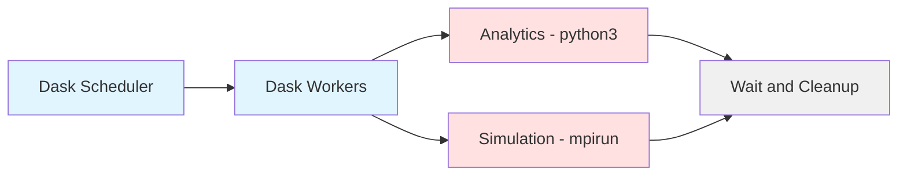

</div>

> The simulation generates 5D particle distribution functions (gyrokinetic plasma physics). Analytics computes fluid moments (density, velocity, temperature) in-situ via Dask + Deisa.


We can change Python or C++ sources, build again, and launch the simulation again.


---

## Quick look at the Gysela output

You can retrieve the generated images on your laptop:

```
$ rsync -r lille.g5k:gysela-mini-app_io/gysela_plots/ .
```

Have a look at the density at each iteration:

<div class="grid grid-cols-5 gap-2">
  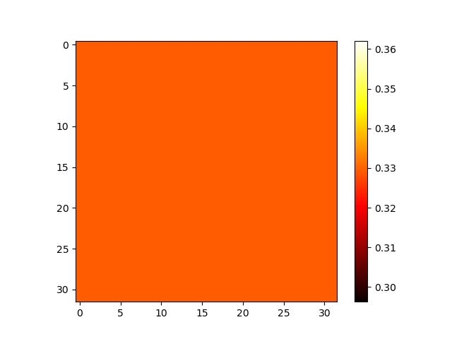
  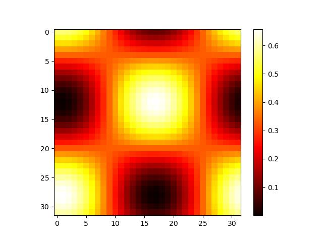
  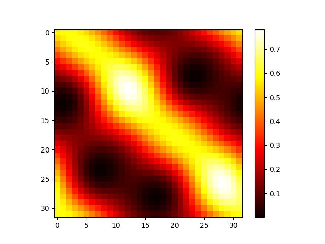
  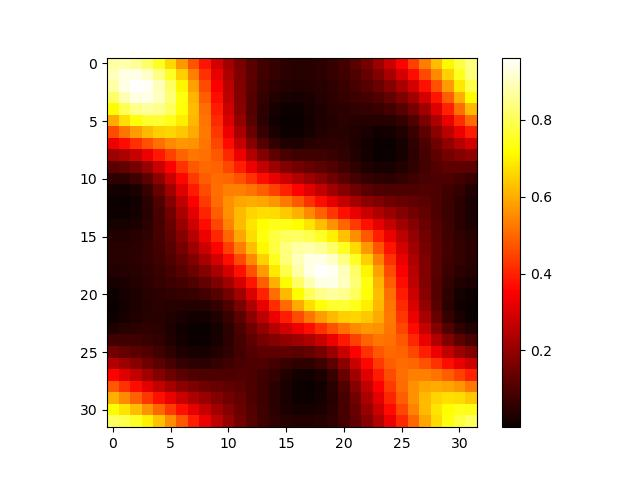
  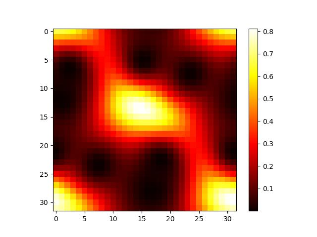
  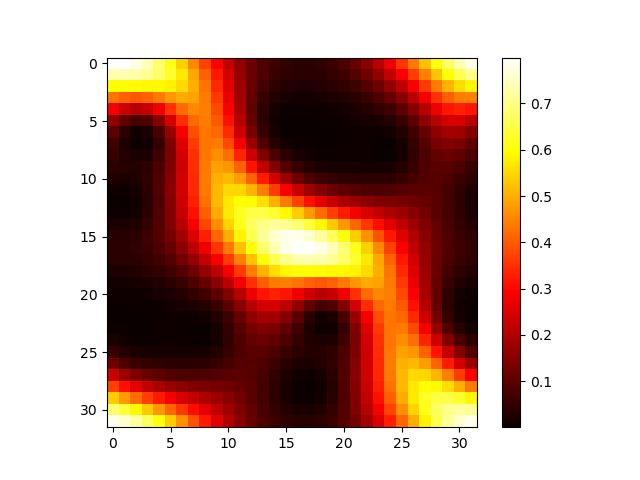
  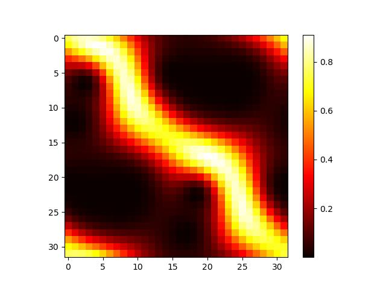
  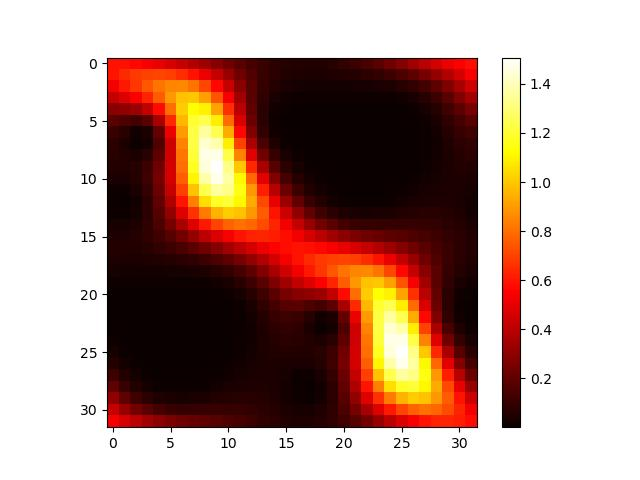
  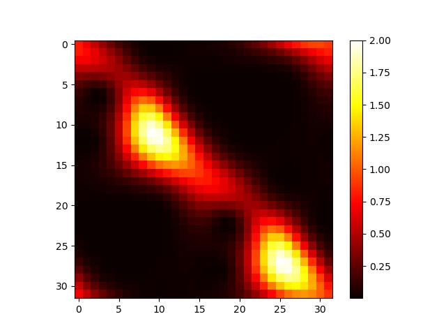
  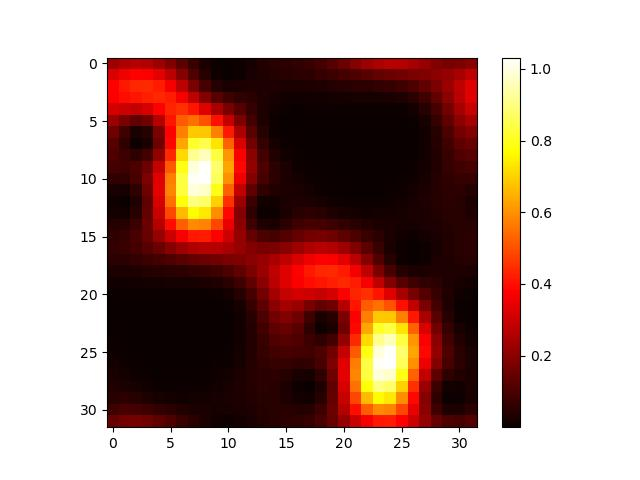
</div>


---

## Developing a package 1/3

What if we need to edit a package already in Spack like `py-deisa-dask`? The `spack develop` command marks the given spec as a 'develop' package:

```
$ spack develop py-deisa-dask
```

just updates the `spack.yaml` file:

```yaml
spack:
  specs:
  - ...
  - py-deisa-dask
  develop:
    py-deisa-dask:
      spec: py-deisa-dask@=0.3.0
```

An existing path can be provided with `spack develop --path <path> <spec>`.

---

## Developing a package 2/3

Looking at the concretized specs using `spack spec`, you will see a "reserved" variant <span class="color-blue">dev_path=</span>.

```
-   py-deisa-dask@0.3.0 build_system=python_pip dev_path=/home/tbouvier/spack/var/spack/environments/gysela-io/py-deisa-dask platform=linux os=debian11 target=x86_64 
[+]      ^py-deisa-core@0.1.0 build_system=python_pip platform=linux os=debian11 target=x86_64 
```

Let's modify a source file (adding a simple `print()` statement):

```
$ vim ~/spack/var/spack/environments/gysela-io/py-deisa-dask/src/deisa/dask/deisa.py
```

Now, `spack install` will automatically do an overwrite install if any of the local source files changes.


---

## We need a patch first :( 3/3

Currently, specs marked as 'develop' interfere with the buildcache. We do not want this.

The following patch is required for our workflow and <span v-mark.red="1">will be merged very soon in upstream Spack</span>.


```
$ git remote add fork https://github.com/thomas-bouvier/spack
$ git fetch fork
$ git stash
$ git checkout feat/filter-develop-deps-from-cache
$ git stash apply
```

Ok, we can just `spack install` to build the local copy of `py-deisa-dask`:

```
$ spack install  # This will build the local copy
```

---

## Recommended workflows

For local development:

- Start with a Spack environment `spack.yaml`.
- Add your project dependencies to it.
- Build your application as usual.

For more advanced users:

- Write a Spack recipe for your application / library.
- Use the `spack develop` to build it using Spack commands only.


---
layout: center
---

# Advanced topics


---
src: ./slides/externals.md
---

---

## Writing a package recipe

- [Official documentation](https://spack-tutorial.readthedocs.io/en/latest/tutorial_packaging.html) on package recipes.
- `spack create -n my-package`: Generate a new package recipe.

```python
class MyPackage(CMakePackage):
  git = "file:///path/to/repo"  # or https://...

  version("main", branch="main")

  depends_on("mpi")
  depends_on("blas")
  depends_on("cuda")
```

```yaml
spack:
  specs:
  - my-package ^cuda@11 ^mpich@4 +fortran ^openblas
```


---
src: ./slides/sources.md
---
