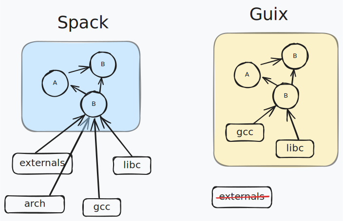

---
# You can also start simply with 'default'
theme: seriph
colorSchema: auto
# random image from a curated Unsplash collection by Anthony
# like them? see https://unsplash.com/collections/94734566/slidev
# background: https://cdn.jsdelivr.net/gh/slidevjs/slidev-covers@main/static/tZr3_JuURZA.webp
background: https://images.pexels.com/photos/11047223/pexels-photo-11047223.jpeg?cs=srgb&dl=pexels-vlad-samoylik-173187996-11047223.jpg&fm=jpg&w=1920&h=1282
# some information about your slides (markdown enabled)
title: Spack tutorial
info: |
  ## Slidev Starter Template
  Presentation slides for developers.

  Learn more at [Sli.dev](https://sli.dev)
# apply unocss classes to the current slide
class: text-center
# https://sli.dev/features/drawing
drawings:
  persist: false
# slide transition: https://sli.dev/guide/animations.html#slide-transitions
transition: slide-left
# enable MDC Syntax: https://sli.dev/features/mdc
mdc: false
# open graph
# seoMeta:
#  ogImage: https://cover.sli.dev
fonts:
  mono: iosevka-normal
  local: iosevka-normal
favicon: https://numpex-pc5.gitlabpages.inria.fr/tutorials/images/favicon.png

hideInToc: true
---

<h1 class="font-black">Spack tutorial</h1>

## NumPEx WP3 / WP4


Fernando Ayats

---

<Toc maxDepth="1" />

---
src: ./slides/intro.md
---

---
hideInToc: true
layout: center
---

# Getting started with Spack

---

## The mental model

These are some of the key insights to understand how Spack works:

- 📦 Install Spack by cloning the [repo](https:://github.com/spack/spack). Multiple installations allowed.
- ✅ Activate Spack to run commands.
- ⚙️ Commands: install, uninstall, find, etc.
- 📌 Package versions are fixed in your Spack clone.
- 🤝 Integrates system packages with Spack packages.
- 🎛️ Package specs allow options like <code class="color-purple">+cuda</code>.
- 🌍 Environments enable global package installations.


---


To install Spack, we must clone the repo

```ansi
# Clone Spack
$ git clone https://github.com/spack/spack

# Filter to get less files (310M -> 194M), and optimize for slow disks
$ git clone -c feature.manyFiles=true --filter=blob:none https://github.com/spack/spack
```

<v-click>

```ansi
# Activate Spack
$ . spack/share/spack/setup-env.sh
# If you use fish: source spack/share/spack/setup-env.fish
```

</v-click>


<v-click>

```
$ spack --version
1.0.0.dev0 (199133fca402022a27002a54f25d735e7a27cce5)
```

The Spack executable and the versions for all packages are **self-contained** in the Spack folder.

</v-click>


---

## Some Spack commands

| Command | Description |
|---------|-------------|
| `spack list` | List **available** packages |
| `spack find` | List **installed** packages |
| `spack info` | Display information about a package |
| `spack env` | Manage **environments** |
| `spack install` | Install packages |
| `spack spec` | Display the dependency graph for a package |


---

## Finding a package

```ansi
$ spack list kokkos
hpx-kokkos  kokkos  kokkos-kernels  kokkos-kernels-legacy  kokkos-legacy  kokkos-nvcc-wrapper  kokkos-tools  py-pennylane-lightning-kokkos  py-pykokkos-base
==> 9 packages
```

<v-click>

```ansi
$ spack info kokkos
CMakePackage:   kokkos

Description:
    Kokkos implements a programming model in C++ for writing performance
    portable applications targeting all major HPC platforms.

Homepage: https://github.com/kokkos/kokkos

Preferred version:  
    4.5.01     https://github.com/kokkos/kokkos/releases/download/4.5.01/kokkos-4.5.01.tar.gz
```

</v-click>

---


## Package specs

```ansi{1,2}
$ spack spec kokkos
 -   kokkos@4.5.01~aggressive_vectorization~alloc_async~cmake_lang~compiler_warnings+complex_align+cuda~cuda_constexpr~cuda_lambda~cuda_ldg_intrinsic~cuda_relocatable_device_code~cuda_uvm~debug~debug_bounds_check~debug_dualview_modify_check~deprecated_code~examples~hip_relocatable_device_code~hpx~hpx_async_dispatch~hwloc~ipo~memkind~numactl~openmp~openmptarget~pic~rocm+serial+shared~sycl~tests~threads~tuning~wrapper build_system=cmake build_type=Release cuda_arch=120 cxxstd=17 generator=make intel_gpu_arch=none arch=linux-ubuntu24.04-icelake
[+]      ^cmake@3.31.6~doc+ncurses+ownlibs~qtgui build_system=generic build_type=Release arch=linux-ubuntu24.04-icelake
[+]          ^curl@8.11.1~gssapi~ldap~libidn2~librtmp~libssh~libssh2+nghttp2 build_system=autotools libs=shared,static tls=openssl arch=linux-ubuntu24.04-icelake
[+]              ^nghttp2@1.65.0 build_system=autotools arch=linux-ubuntu24.04-icelake
[+]                  ^diffutils@3.10 build_system=autotools arch=linux-ubuntu24.04-icelake
[+]              ^openssl@3.4.1~docs+shared build_system=generic certs=mozilla arch=linux-ubuntu24.04-icelake
[+]                  ^ca-certificates-mozilla@2025-02-25 build_system=generic arch=linux-ubuntu24.04-icelake
...
```


Instead of package names, Spack uses **package specs**:

<code>
kokkos <span class="color-green">@4.5.01</span> <span class="color-purple">~aggressive_vectorization</span> ...
</code>

---

Spec documentation: https://spack.readthedocs.io/en/latest/basic_usage.html#specs-dependencies

- <code>kokkos</code>: Package name
- <code class="color-green">@4.5.01</code>: [Version specifier](https://spack.readthedocs.io/en/latest/basic_usage.html#version-specifier).
  - Spack concretizes packages to a fixed version <code class="color-green">@X.Y.Z</code>.
  - As a user, you can specify a version range, e.g:
    - <code class="color-green">@4.5:</code>: Take <code class="color-green">@4.5.0</code>, <code class="color-green">@4.5.1</code>, etc.
- <code class="color-purple">~aggressive_vectorization</code>: Variant specifier.
  - <code class="color-purple">+</code> means the feature is enabled.
  - <code class="color-purple">~</code> (or <code class="color-purple">-</code>) means the feature is disabled.
  - Variants can also be <code class="color-purple">name=value</code> pairs.
- <code class="color-blue">target=x86_64</code>: Target specifier.
  - Similar to variants, but present in all packages.
  - Allows you to target some compiler microarhitecture, e.g. <code class="color-blue">target=haswell</code>

---

```ansi{1,2,9}
$ spack spec kokkos +cuda cuda_arch=120
 -   kokkos@4.5.01~aggressive_vectorization~alloc_async~cmake_lang~compiler_warnings+complex_align+cuda~cuda_constexpr~cuda_lambda~cuda_ldg_intrinsic~cuda_relocatable_device_code~cuda_uvm~debug~debug_bounds_check~debug_dualview_modify_check~deprecated_code~examples~hip_relocatable_device_code~hpx~hpx_async_dispatch~hwloc~ipo~memkind~numactl~openmp~openmptarget~pic~rocm+serial+shared~sycl~tests~threads~tuning~wrapper build_system=cmake build_type=Release cuda_arch=120 cxxstd=17 generator=make intel_gpu_arch=none arch=linux-ubuntu24.04-icelake
[+]      ^cmake@3.31.6~doc+ncurses+ownlibs~qtgui build_system=generic build_type=Release arch=linux-ubuntu24.04-icelake
[+]          ^curl@8.11.1~gssapi~ldap~libidn2~librtmp~libssh~libssh2+nghttp2 build_system=autotools libs=shared,static tls=openssl arch=linux-ubuntu24.04-icelake
...
[+]          ^ncurses@6.5~symlinks+termlib abi=none build_system=autotools patches=7a351bc arch=linux-ubuntu24.04-icelake
[+]          ^zlib-ng@2.2.3+compat+new_strategies+opt+pic+shared build_system=autotools arch=linux-ubuntu24.04-icelake
[+]      ^compiler-wrapper@1.0 build_system=generic arch=linux-ubuntu24.04-icelake
 -       ^cuda@12.8.0~allow-unsupported-compilers~dev build_system=generic arch=linux-ubuntu24.04-icelake
[+]          ^libxml2@2.13.5~http+pic~python+shared build_system=autotools arch=linux-ubuntu24.04-icelake
[+]              ^libiconv@1.17 build_system=autotools libs=shared,static arch=linux-ubuntu24.04-icelake
[+]              ^xz@5.6.3~pic build_system=autotools libs=shared,static arch=linux-ubuntu24.04-icelake
[e]      ^gcc@13.3.0~binutils+bootstrap~graphite~mold~nvptx~piclibs~profiled~strip build_system=autotools build_type=RelWithDebInfo languages='c,c++,fortran' arch=linux-ubuntu24.04-icelake
...
```

Now we build the **CUDA-enabled Kokkos** tweaked for the `120` CUDA architecture.

---

## Package installation

So, we're going to install Kokkos and some other packages, how do we do it?

```
$ spack install kokkos
...
```

<v-click>

...but let's use <span v-mark.red="1">environments</span> instead!


- 📦 Declarative -- run a single install command for everything.
- 👥 Shareable -- share the environment file with your colleagues.
- 🔒 Isolated -- environments won't conflict between each other.

</v-click>

---

## Spack environments

From the [official documentation](https://spack.readthedocs.io/en/latest/environments.html):

<blockquote>

An environment is used to group a set of specs intended for some purpose to be built, rebuilt, and deployed in a coherent fashion. Environments define aspects of the installation of the software, such as:
  - which specs to install;
  - how those specs are configured; and
  - where the concretized software will be installed.

</blockquote>

<br/>

```ansi
$ spack env create --dir /tmp	/test
==> Created independent environment in: /tmp/test
==> Activate with: spack env activate /tmp/test

$ spack env activate ~/myenv
```

---
hideInToc: true
---

The generated environment will look like the following:

```yaml
# ~/myenv/spack.yaml
spack:
  specs: []
  view: true
  concretizer:
    unify: true
```

- <span v-mark.red="-1"><code>specs</code>: List of packages to install.</span>

Less importantly:
- `view`: Whether the packages are exposed to the user.
- `concretizer:unify`: Run a single pass of the "concretizer" (more on that later).

---

To add packages to the environment, we have 2 options:

- Manually edit the `spack.yaml` file.
- Call `spack add <spec>`, which will edit the environment for us.

```ansi
$ spack add kokkos
==> Adding kokkos to environment /home/ubuntu/myenv
```

<br/>

```yaml
spack:
  specs:
  - kokkos
  view: true
  concretizer:
    unify: true
```

---

## Environment concretization

<br/>

<div class="w-full flex flex-row justify-center">


</div>

Concretization checks the system environment and the requested versions of the
packages to calculate the graph of dependencies.

This will generate a `spack.lock` file that should be committed alongside the `spack.yaml`. It
will lock every version of every package in place.

```ansi
$ spack concretize

# To force concretization and ignore existing packages
$ spack concretize -Uf
```

---

```ansi {1,2}
fayatsllamas@chifflot-2 $ spack spec
 -   cmake@3.31.6~doc+ncurses+ownlibs~qtgui build_system=generic build_type=Release arch=linux-debian11-skylake_avx512
 -       ^compiler-wrapper@1.0 build_system=generic arch=linux-debian11-skylake_avx512
 -       ^curl@8.11.1~gssapi~ldap~libidn2~librtmp~libssh~libssh2+nghttp2 build_system=autotools libs:=shared,static tls:=openssl arch=linux-debian11-skylake_avx512
 -           ^nghttp2@1.65.0 build_system=autotools arch=linux-debian11-skylake_avx512
 -               ^diffutils@3.10 build_system=autotools arch=linux-debian11-skylake_avx512
 -                   ^libiconv@1.17 build_system=autotools libs:=shared,static arch=linux-debian11-skylake_avx512
 -           ^openssl@3.4.1~docs+shared build_system=generic certs=mozilla arch=linux-debian11-skylake_avx512
 -               ^ca-certificates-mozilla@2025-02-25 build_system=generic arch=linux-debian11-skylake_avx512
 -               ^perl@5.40.0+cpanm+opcode+open+shared+threads build_system=generic arch=linux-debian11-skylake_avx512
 -                   ^berkeley-db@18.1.40+cxx~docs+stl build_system=autotools patches:=26090f4,b231fcc arch=linux-debian11-skylake_avx512
 -                   ^bzip2@1.0.8~debug~pic+shared build_system=generic arch=linux-debian11-skylake_avx512
 -                   ^gdbm@1.23 build_system=autotools arch=linux-debian11-skylake_avx512
 -                       ^readline@8.2 build_system=autotools patches:=1ea4349,24f587b,3d9885e,5911a5b,622ba38,6c8adf8,758e2ec,79572ee,a177edc,bbf97f1,c7b45ff,e0013d9,e065038 arch=linux-debian11-skylake_avx512
 -           ^pkgconf@2.3.0 build_system=autotools arch=linux-debian11-skylake_avx512
[e]      ^gcc@10.2.1~binutils+bootstrap~graphite~nvptx~piclibs~profiled~strip build_system=autotools build_type=RelWithDebInfo languages:='c,c++,fortran' patches:=0d13622,2c18531,b5e049d,bd4828c,cc6112d arch=linux-debian11-skylake_avx512
 -       ^gcc-runtime@10.2.1 build_system=generic arch=linux-debian11-skylake_avx512
[e]      ^glibc@2.31 build_system=autotools arch=linux-debian11-skylake_avx512
 -       ^gmake@4.4.1~guile build_system=generic arch=linux-debian11-skylake_avx512
 -       ^ncurses@6.5~symlinks+termlib abi=none build_system=autotools patches:=7a351bc arch=linux-debian11-skylake_avx512
 -       ^zlib-ng@2.2.4+compat+new_strategies+opt+pic+shared build_system=autotools arch=linux-debian11-skylake_avx512
 -   kokkos@4.6.00~aggressive_vectorization~cmake_lang~compiler_warnings+complex_align~cuda~debug~debug_bounds_check~debug_dualview_modify_check~deprecated_code~examples~hip_relocatable_device_code~hpx~hpx_async_dispatch~hwloc~ipo~memkind~numactl~openmp~openmptarget~pic~rocm+serial+shared~sycl~tests~threads~tuning~wrapper build_system=cmake build_type=Release cxxstd=17 generator=make intel_gpu_arch=none arch=linux-debian11-skylake_avx512
```

<br/>

- <code class="text-pink">arch=linux-debian11-skylake_avx512</code> When concretized on the machine `chifflot-2`.
- <code class="text-pink">arch=linux-ubuntu24.04-icelake</code> When concretized on my laptop.

<style>
pre {
  max-height: 300px;
}
</style>

---

Spack's concretizer also considers external dependencies from the system, while Guix is completely isolated down to `libc`.

<div class="flex justify-center">
  
</div>


---

Spack uses the **concretizer** will try to reconcile all specification bounds, using a [SAT solver (clingo)](https://github.com/potassco/clingo).

- Package A requires <code>hdf5<span class="color-green">@1.10.0:</span><span class="color-purple">+mpi</span></code>
- Package B requires <code>hdf5<span class="color-green">@1.14.0:</span></code>
- **Result**: Spack will use <code>hdf5<span class="color-green">@1.14.0:</span><span class="color-purple">+mpi</span></code>

<br/>

- Package A requires <code>bazel<span class="color-green">@6</span></code>
- Package B requires <code>bazel<span class="color-green">@7</span></code>
- **Result**: Concretization error. May be worked around by allowing 2 different Bazel's in the dependency graph, etc.


---

`spack concretize` will generate the `spack.lock` alongside your `spack.yaml`.
If skip the concretization step, `spack install` will concretize for each run (which takes time), and won't save it to the `spack.lock`.

**Important**: you should always commit your lockfiles.


```json
// spack.lock
{
  "_meta": {
    "file-type": "spack-lockfile",
    "lockfile-version": 6,
    "specfile-version": 5
  },
  "spack": {
    "version": "1.0.0.dev0",
    "type": "git",
    "commit": "199133fca402022a27002a54f25d735e7a27cce5"
  },
  "roots": [
    {
      "hash": "ylsnhrukizj6kfprn5rbawyaophnkwgw",
      "spec": "kokkos"
    }
  ],
  "concrete_specs": {
    "ylsnhrukizj6kfprn5rbawyaophnkwgw": {
      "name": "kokkos",
// ...
```

<style>
pre {
  font-size: 0.5rem !important;
  line-height: 0.5rem !important;
}
</style>


---

## Preparing a development environment

Let's add other tools to the environment before installation.

```ansi
$ spack add cmake
==> Adding cmake to environment /home/ubuntu/myenv

$ spack concretize -Uf
==> Concretized 2 specs:
[+]  se36owz  cmake@3.31.6~doc+ncurses+ownlibs~qtgui build_system=generic build_type=Release arch=linux-ubuntu24.04-icelake
     ...
==> Updating view at /home/ubuntu/myenv/.spack-env/view
$
```

---

We can use the `spack spec` command to show a spec. If you don't provide a spec, it will print the spec for the
activated environment.


```ansi
[+]  cmake@3.31.6~doc+ncurses+ownlibs~qtgui build_system=generic build_type=Release arch=linux-ubuntu24.04-icelake
[+]      ^compiler-wrapper@1.0 build_system=generic arch=linux-ubuntu24.04-icelake
[-]          ^openssl@3.4.1~docs+shared build_system=generic certs=mozilla arch=linux-ubuntu24.04-icelake
[+]              ^ca-certificates-mozilla@2025-02-25 build_system=generic arch=linux-ubuntu24.04-icelake
[+]              ^perl@5.40.0+cpanm+opcode+open+shared+threads build_system=generic arch=linux-ubuntu24.04-icelake
[+]          ^pkgconf@2.3.0 build_system=autotools arch=linux-ubuntu24.04-icelake
[+]      ^zlib-ng@2.2.3+compat+new_strategies+opt+pic+shared build_system=autotools arch=linux-ubuntu24.04-icelake
 -   kokkos@4.5.01~aggressive_vectorization~cmake_lang~compiler_warnings+complex_align~cuda~debug~debug_bounds_check~debug_dualview_modify_check~deprecated_code~examples~hip_relocatable_device_code~hpx~hpx_async_dispatch~hwloc~ipo~memkind~numactl~openmp~openmptarget~pic~rocm+serial+shared~sycl~tests~threads~tuning~wrapper build_system=cmake build_type=Release cxxstd=17 generator=make intel_gpu_arch=none arch=linux-ubuntu24.04-icelake
...
```

- <code class="text-green">[+]</code>: already installed.
- <code class="text-gray whitespace-pre"> - </code> or <code class="text-red">[-]</code>: not installed or uninstalled.

---

```ansi
$ spack install
    ...
==> kokkos: Executing phase: 'install'
==> kokkos: Successfully installed kokkos-4.5.01-ylsnhrukizj6kfprn5rbawyaophnkwgw
  Stage: 0.06s.  Cmake: 0.31s.  Build: 4.76s.  Install: 0.11s.  Post-install: 0.09s.  Total: 5.38s
[+] /home/ubuntu/.spack/install/[padded-to-128-chars]/linux-icelake/kokkos-4.5.01-ylsnhrukizj6kfprn5rbawyaophnkwgw
==> Updating view at /home/ubuntu/myenv/.spack-env/view
```

<div class="second">

```ansi
$ spack spec
[+]  cmake@3.31.6~doc+ncurses+ownlibs~qtgui build_system=generic build_type=Release arch=linux-ubuntu24.04-icelake
[+]      ^compiler-wrapper@1.0 build_system=generic arch=linux-ubuntu24.04-icelake
[+]      ^curl@8.11.1~gssapi~ldap~libidn2~librtmp~libssh~libssh2+nghttp2 build_system=autotools libs=shared,static tls=openssl arch=linux-ubuntu24.04-icelake
[+]          ^nghttp2@1.65.0 build_system=autotools arch=linux-ubuntu24.04-icelake
[+]              ^diffutils@3.10 build_system=autotools arch=linux-ubuntu24.04-icelake
[+]                  ^libiconv@1.17 build_system=autotools libs=shared,static arch=linux-ubuntu24.04-icelake
[+]          ^openssl@3.4.1~docs+shared build_system=generic certs=mozilla arch=linux-ubuntu24.04-icelake
[+]              ^ca-certificates-mozilla@2025-02-25 build_system=generic arch=linux-ubuntu24.04-icelake
[+]              ^perl@5.40.0+cpanm+opcode+open+shared+threads build_system=generic arch=linux-ubuntu24.04-icelake
[+]                  ^berkeley-db@18.1.40+cxx~docs+stl build_system=autotools patches=26090f4,b231fcc arch=linux-ubuntu24.04-icelake
[+]                  ^bzip2@1.0.8~debug~pic+shared build_system=generic arch=linux-ubuntu24.04-icelake
[+]                  ^gdbm@1.23 build_system=autotools arch=linux-ubuntu24.04-icelake
[+]                      ^readline@8.2 build_system=autotools patches=1ea4349,24f587b,3d9885e,5911a5b,622ba38,6c8adf8,758e2ec,79572ee,a177edc,bbf97f1,c7b45ff,e0013d9,e065038 arch=linux-ubuntu24.04-icelake
[+]          ^pkgconf@2.3.0 build_system=autotools arch=linux-ubuntu24.04-icelake
[e]      ^gcc@13.3.0~binutils+bootstrap~graphite~mold~nvptx~piclibs~profiled~strip build_system=autotools build_type=RelWithDebInfo languages='c,c++,fortran' arch=linux-ubuntu24.04-icelake
[+]      ^gcc-runtime@13.3.0 build_system=generic arch=linux-ubuntu24.04-icelake
[e]      ^glibc@2.39 build_system=autotools arch=linux-ubuntu24.04-icelake
[+]      ^gmake@4.4.1~guile build_system=generic arch=linux-ubuntu24.04-icelake
[+]      ^ncurses@6.5~symlinks+termlib abi=none build_system=autotools patches=7a351bc arch=linux-ubuntu24.04-icelake
[+]      ^zlib-ng@2.2.3+compat+new_strategies+opt+pic+shared build_system=autotools arch=linux-ubuntu24.04-icelake
[+]  kokkos@4.5.01~aggressive_vectorization~cmake_lang~compiler_warnings+complex_align~cuda~debug~debug_bounds_check~debug_dualview_modify_check~deprecated_code~examples~hip_relocatable_device_code~hpx~hpx_async_dispatch~hwloc~ipo~memkind~numactl~openmp~openmptarget~pic~rocm+serial+shared~sycl~tests~threads~tuning~wrapper build_system=cmake build_type=Release cxxstd=17 generator=make intel_gpu_arch=none arch=linux-ubuntu24.04-icelake
```

</div>

<style>
.second pre  {
  max-height: 200px;
}
</style>

---
src: ./slides/compiler.md
---


---
layout: center
---

# Writing a package definition


---

# Exploring Dependencies

View dependency information before installing:

```bash
# See resolved dependencies without installing
$ spack spec -I hdf5+mpi

# Visualize dependency graph
$ spack graph --dot hdf5+mpi | dot -Tpng > hdf5_deps.png
```

<div class="flex justify-center">
  <div class="p-2 bg-slate-100 dark:bg-slate-800 rounded">
    <pre>hdf5@1.12.2%gcc@10.3.0+mpi
    └─ openmpi@4.1.4%gcc@10.3.0
        ├─ hwloc@2.8.0%gcc@10.3.0
        │   └─ libpciaccess@0.16%gcc@10.3.0
        └─ openssh@9.0p1%gcc@10.3.0</pre>
  </div>
</div>

---

# Spack Environments

Environments help manage collections of packages:

```bash
# Create a new environment
$ spack env create myproject

# Activate the environment
$ spack env activate myproject

# Add packages to the environment
(myproject) $ spack add openmpi cuda hdf5+mpi

# Install everything in the environment
(myproject) $ spack install

# Deactivate when done
(myproject) $ spack env deactivate
```

---

# Environment Files (spack.yaml)

Create reproducible environments with a YAML file:

```yaml
# Example spack.yaml for MPI+CUDA application
spack:
  specs:
  - openmpi@4.1.4
  - cuda@11.4.0
  - hdf5+mpi
  - fftw+mpi+cuda
  concretizer:
    unify: true
  view: true
```

```bash
# Create and install from file
$ spack env create cuda-mpi-env spack.yaml
$ spack env activate cuda-mpi-env
$ spack install
```

---

# Compiler Configuration

View available compilers:

```bash
$ spack compilers
==> Available compilers
-- gcc centos7-x86_64 ------------------------------
gcc@10.3.0  gcc@8.5.0

-- intel centos7-x86_64 -----------------------------
intel@19.0.4
```

Add a new compiler:

```bash
# Auto-detect compilers
$ spack compiler find

# Add compiler manually
$ spack compiler add /path/to/custom/compiler
```

---

# Compiler Configuration File

Manual configuration in `~/.spack/linux/compilers.yaml`:

```yaml
compilers:
- compiler:
    spec: gcc@10.3.0
    paths:
      cc: /opt/gcc/10.3.0/bin/gcc
      cxx: /opt/gcc/10.3.0/bin/g++
      f77: /opt/gcc/10.3.0/bin/gfortran
      fc: /opt/gcc/10.3.0/bin/gfortran
    flags:
      cflags: -O3
      cxxflags: -O3
    operating_system: centos7
    target: x86_64
```

---

# Package Flags and Options

Customize compiler flags for specific packages:

```yaml
# ~/.spack/packages.yaml
packages:
  openmpi:
    compiler: [gcc@10.3.0]
    variants: +thread_multiple fabrics=ofi,ucx
  all:
    compiler: [gcc, intel, nvhpc]
    providers:
      mpi: [openmpi, mpich, intel-mpi]
      blas: [openblas, intel-mkl]
```

```bash
# Install with specific flags
$ spack install hdf5 cflags="-O3 -ffast-math" cxxflags="-O3"
```

---

# Writing a Package Definition

Basic structure of a package definition (`package.py`):

```python
from spack import *

class MyPackage(CMakePackage):
    """Description of the package"""

    homepage = "https://example.com/mypackage"
    url      = "https://example.com/mypackage-1.0.tar.gz"

    version('1.0', sha256='abc123...')

    variant('mpi', default=True, description='Build with MPI support')
    variant('cuda', default=False, description='Build with CUDA support')

    depends_on('mpi', when='+mpi')
    depends_on('cuda', when='+cuda')

    def cmake_args(self):
        args = []
        if '+mpi' in self.spec:
            args.append('-DUSE_MPI=ON')
        if '+cuda' in self.spec:
            args.append('-DUSE_CUDA=ON')
        return args
```

---

# Package Definition - Build Systems

Spack supports multiple build systems through base classes:

- `CMakePackage`: for CMake-based packages
- `AutotoolsPackage`: for autotools-based packages
- `PythonPackage`: for Python packages
- `MakefilePackage`: for Makefile-based projects
- `CudaPackage`: helper for CUDA packages

```python
# Example for MPI library using Autotools
class MyMpiLib(AutotoolsPackage):
    def configure_args(self):
        args = ['--enable-shared']
        if '+cuda' in self.spec:
            args.append('--with-cuda={0}'.format(self.spec['cuda'].prefix))
        return args
```

---

# MPI-specific Package Example

```python
class MpiApplication(CMakePackage, CudaPackage):
    """Example MPI application with CUDA support"""

    depends_on('mpi')
    depends_on('cuda@11:', when='+cuda')
    depends_on('hdf5+mpi')

    def cmake_args(self):
        args = [
            self.define('MPI_HOME', self.spec['mpi'].prefix),
            self.define('HDF5_ROOT', self.spec['hdf5'].prefix)
        ]

        if '+cuda' in self.spec:
            args.extend([
                self.define('ENABLE_CUDA', True),
                self.define('CMAKE_CUDA_ARCHITECTURES', self.cuda_arch_list())
            ])

        return args
```

---

# Testing Your Package

Add tests to verify correct installation:

```python
class MyMpiApp(CMakePackage):
    # ... other package definitions ...

    # Add test that runs after installation
    @run_after('install')
    @on_package_attributes(run_tests=True)
    def test_install(self):
        test_exe = join_path(self.prefix.bin, 'myapp_test')
        self.run_test(test_exe, options=['--simple-test'],
                     expected=['Test passed'])

        # MPI test with 4 ranks
        mpiexe = self.spec['mpi'].prefix.bin.mpirun
        self.run_test(mpiexe, options=['-n', '4', test_exe, '--mpi-test'],
                     expected=['MPI test passed'])
```

To run tests during installation: `spack install --test=root myapp`

---
layout: center
---

# Questions?

---
src: ./slides/sources.md
---
