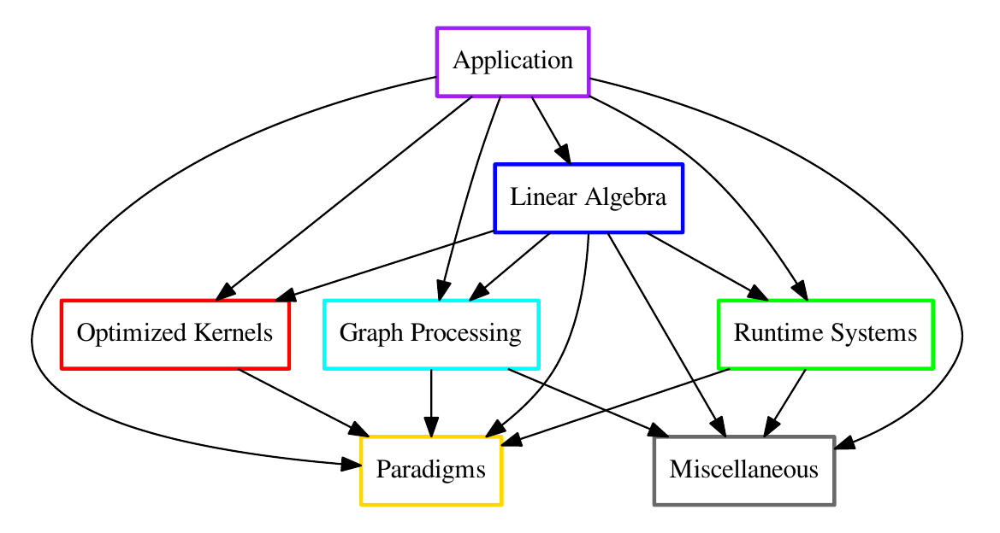

## Abstract

Date/time: Tuesday 28th, April at 2 pm (~2h)

> This Numpex tutorial related to software packaging will specifically target beginners with the Spack package manager. The tutorial will introduce Spack installation, base commands, specifications, configs, and environments. We are also going to cover some slightly more advanced topics, like using the official Numpex binary cache and development workflows. No prior experience with Spack is required.

> The webinar will be organized as a hands-on session so users can directly experiment with Spack. We will provide accounts on Grid'5000 for all attendees. We will be available to assist you and answer questions via video and chat.

> Note that this tutorial is part of the Numpex software integration strategy backed by the Exa-DI WP3 team. Our ambition is to have all Numpex-related libraries packaged with Spack, make Spack-based deployment part of every developer’s arsenal, and work with computing centers to make Spack-based user-level software deployment as frictionless as possible.

---
layout: center
---

# Why package managers? Why Spack?

---

# Streamlining the setup of a complex stack

  

  **How to install these dependencies?**
  - Complex and modular application with build or link-type dependencies, multiple languages, and various build tools
  - Different systems, environments, local machines or HPC clusters
  - Hard to be an expert across the entire toolchain; we want a solution that's easy enough

  

  

  <image class="flex flex-col items-center">
    
    <strong>A complex software stack</strong>
  </image>

  

---

# Gyselalib++: a complex scientific stack

  

  - Gyselalib builds on top of domain expert libraries
    - With heterogeneous languages: CUDA, HIP, SYCL, C++, C, Fortran, Python
    - Libraries have many compile options
    - Some are usually available on clusters but not always built with required options
    - Some are very unlikely available
  - Non exhaustive list of direct dependencies: `DDC`, `Eigen`, `Koliop`, `Kokkos`, `kokkos-fft`, `Kokkos Kernels`, `Ginkgo`, `MPI`, `PDI`, `NetCDF`, `HDF5`, `Dask`, `Xarray`, `h5py`, `matplotlib`...

  

  

  <image class="flex flex-col items-center">
    
    <strong class="text-center">Modeling turbulence in tokamak plasmas</strong>
  </image>

  

---

# Our target as NumPEx PC5

  

  

    <strong v-mark.red="-1">Application developers</strong>
  

  - Ease difficulty in building and developing apps and libraries.
  - Portable solution from a laptop to the supercomputer.
  - CI/CD ready.

  **System administrators**
  - Ease package administration and testing.
  - Align interests of developers and sysadmins.

  **Application users**
  - Provide *turn-key* solutions for deployments.
  - Fearless migrations between machines and updates.

  

  

  <image class="flex flex-col items-center">
    
    <strong>PC5 (ExaDI)</strong>
  </image>

  

---

# Classical way to deploy software

- Manually installing libraries (git clone, CMake, make install, etc.)
  - ❌ Time consuming
  - ❌ Error prone
  - ❌ Automation scripts are fragile
  - ❌ Not very reproducible, with colleagues, other machines or in the future

- `module load <name>`
  - ✅ Cleaner solution than manually installing libraries
  - ❌ Modules are specific to each cluster and not portable
  - ❌ Not reproducible in the future
  - ❌ Limited to the packages and versions provided by the admin team

---

# Use a package manager!

Package managers are very good at managing your dependencies for you.

- ✅ Easy installation of dependencies
- ✅ Reproducible stack of software, without fragile scripts
- ✅ Adaptable to different platforms
- ✅ CI/CD Ready

  
  
  

---

# Why Spack for HPC?

  

  - 🔬 Designed specifically for scientific HPC applications
  - 🔀 Handles different versions and configurations of the same package
  - 🔥 Packages are compiled from source
    - Achieves the optimal performance for your hardware (CPU architecture, GPU micro-architecture, network stack)
    - Supports multiple compilers simultaneously
  - 😃 Easy user experience, but also powerful

  

  

From https://spack.io:

> Spack is a package manager for **supercomputers**, Linux, and macOS. It makes installing scientific software easy.
> Spack isn’t tied to a particular language; you can build a software stack in Python or R, link to libraries written in C, C++, or Fortran, and easily swap compilers or target specific microarchitectures.
